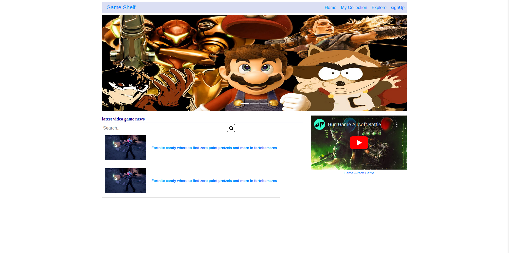
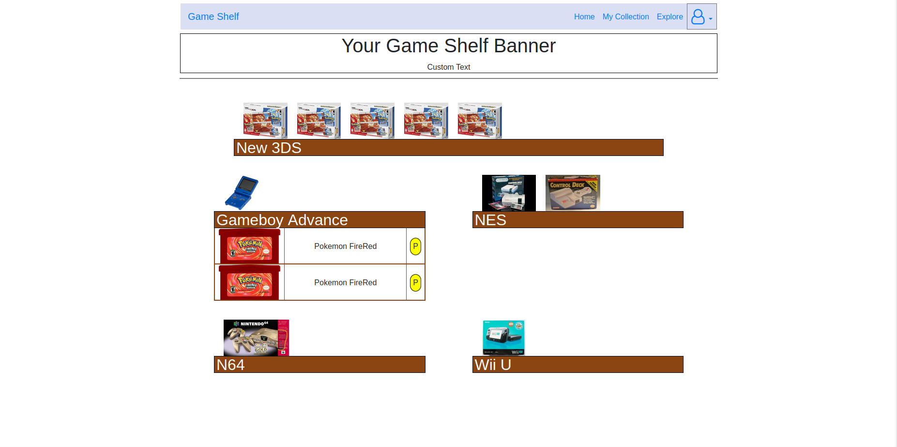
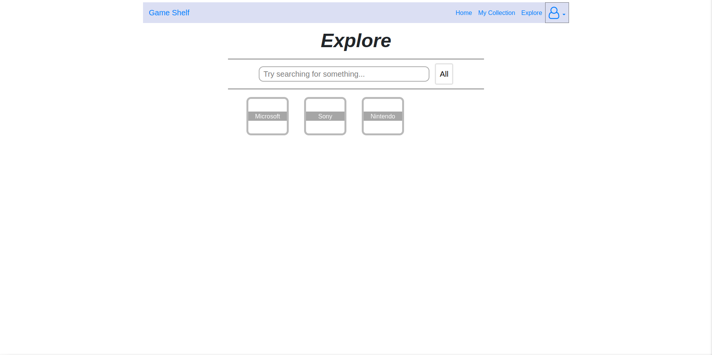
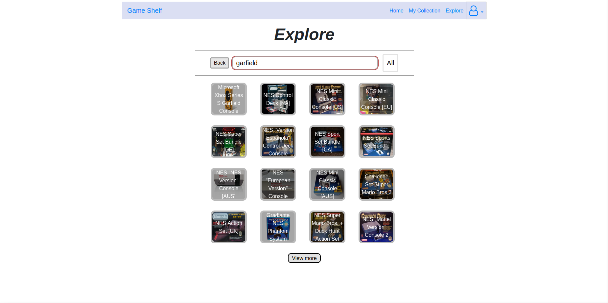
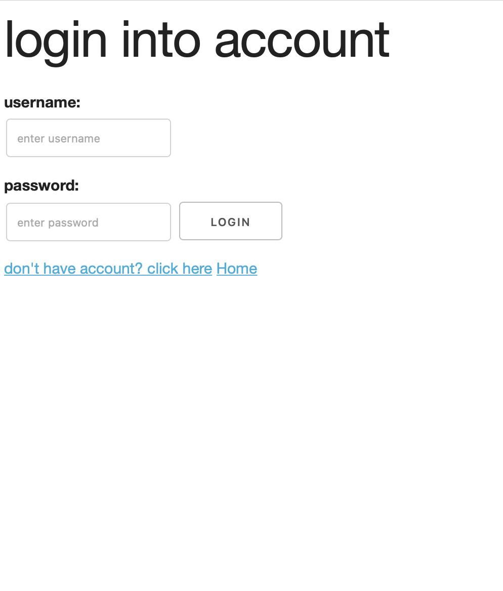
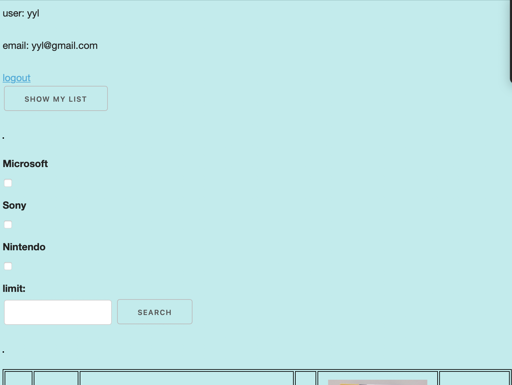
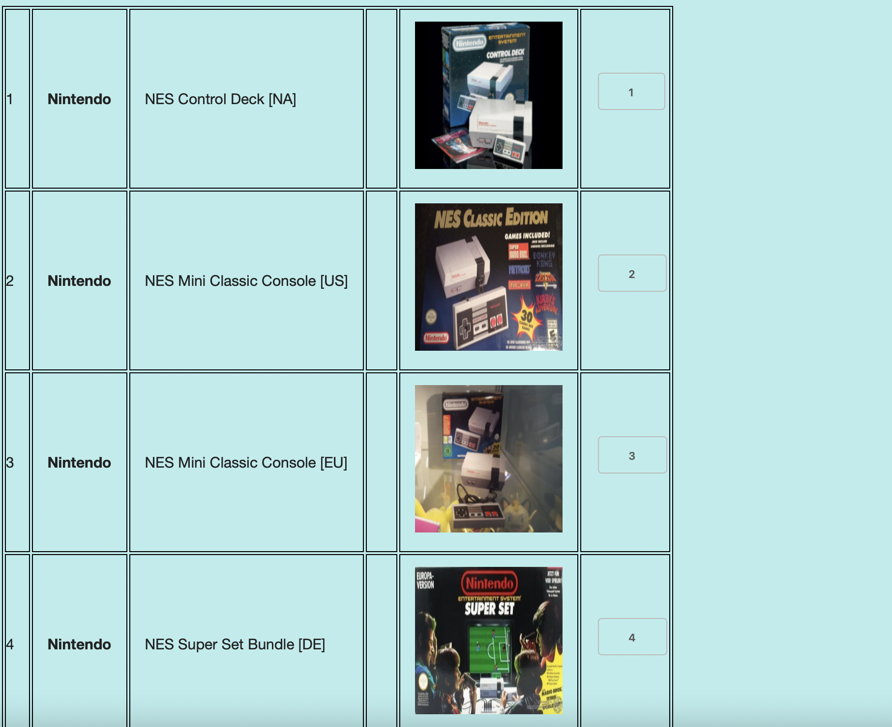
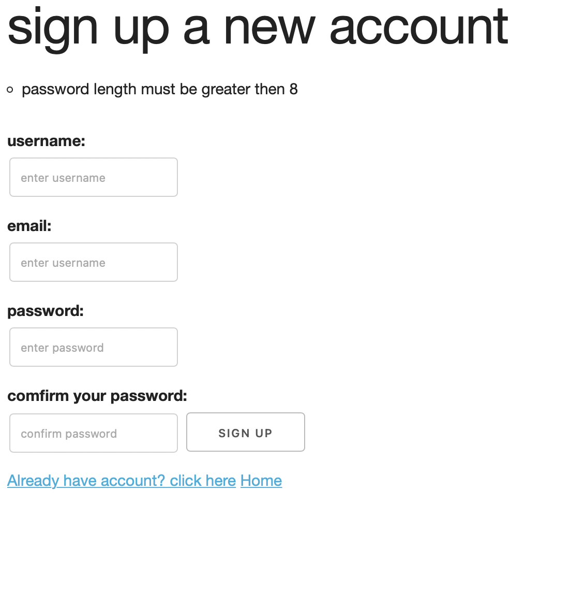
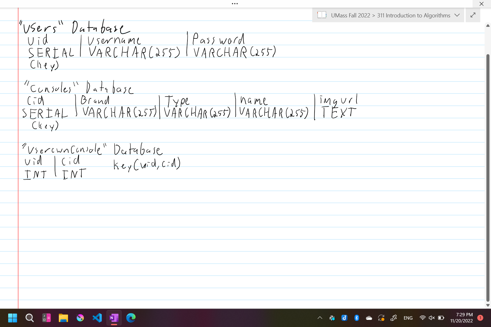
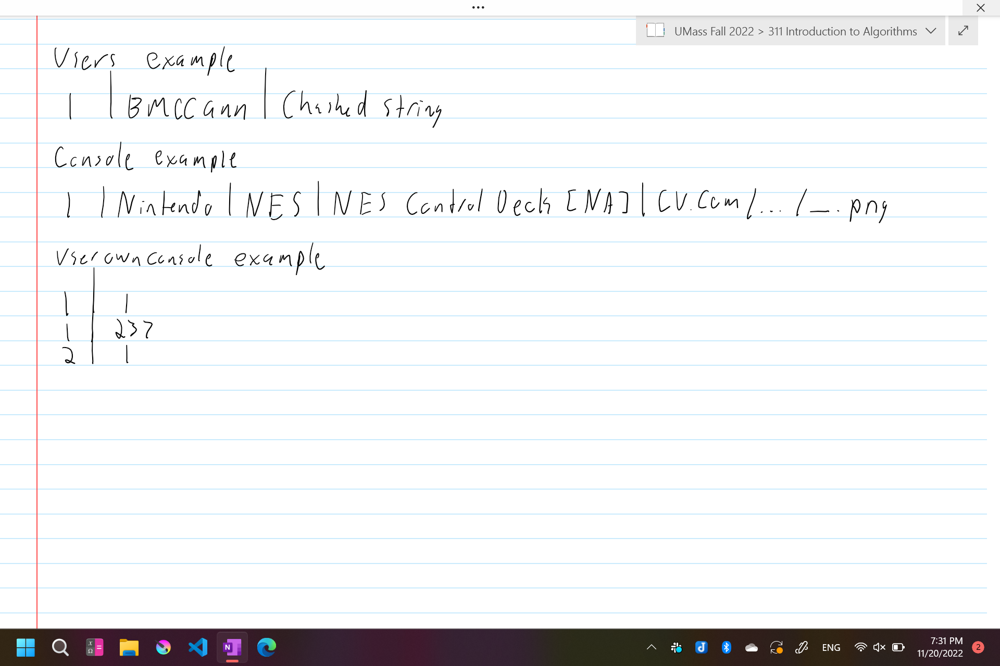

** 
  Team Name: Dalet 
  Game Shelf website 
  Semester: Fall 2022 
  Team: Ben McCann (naginipython), Sam High (SammyPie), Yangyang Lin (Yangyang Lin)
  Website: (https://pacific-beach-91707.herokuapp.com)
** 

  Our website is called Game Shelf, an idea by Ben McCann, and it is a website where one can catelogue different consoles and games that an individual owns. Inspired by MyAnimeList, the a site where individuals can list shows and personally rank each one. Ben has a console collection, and thought it would be awesome if there was a games/console collection website for people to show off what they have collected and the games they have played, as well as how they rank each one.  
  <b>User Interface</b>: Our website consists of 6 pages, an index home page, a collection page, and an explore page, Login Page, User Page after login and Sign Up Page, The index page is fairly standard, it's used to show the user news information. The Collection page shows off a user's collection. Idealistically, it would work on a per-user basis, but we were unable to implement a login that keeps a user signed in. This page will show off consoles one has collected, as well as games they have collected in their generalized console category. The Explore page is where a user "collects" games and consoles. A user can explore via category or by the search bar. Unfortunately, we were unable to implement a game's database API to show games. so we use our static data to implement our game console database and user database, our login page will allow user to login in their account, the server side will validate the user's login and also provide the security via encrypting the user password and authentication, when users login their page, they will able to search console game, able to add the game to their list and also show the list on their page, this is achieve by Crud operation, they also can logout their page, which will return to index page, and the sign up page will allow user to create an account   
  
   (Index Page)
   
   (Collection Page) 
   
   (Collection Page, doing action) 
   
   (Explore Page) 
   
   (Explore Page, using search bar) 
   (Login Page)
   
   (User Page)
   
   
   
   (Sign Up Page)
   
  
  <b>APIs</b>: We unfortunately did not include any external APIs which can retieve the articles from external database,  We had plans for a news article API for the home page, as well as a game database API, but we were unable to implemement them. We do have internal routes sending data from the server database to our website, and also doing the crud operation for users, like search, add, and also in the routes '/thedata' and 'thedatatoo'  
  <b>Database</b>: Our website has 4 databases; Users, csGames, Consoles, and Userownconsole. The User's database contains a automatically incrementing uid, username, and password. The consoles database contains cid (auto inc.), brand, kind, name, and img_url. Every console has a brand behind them, which we use for categorizing them, as well as a 'kind', which we use to generalize what the console is and what kind of games it can play. For instance, one can go to Ninteno > NES > NES Top Loader [NA]. Lastly, we have a img_url which contains an image for nearly every console. The Userownconsole is a database containing uid and cid, and every entry contains a user's id and a console id, with the idea to join databases to get a full database for the case needed. The primary case will be used on the collection page, where we INNER JOIN with the uid to get the data for a user's owned consoles. 
  
   (Ben)
   
   
   (Ben) 
  <b>URL Routes</b>: We have a variety of routes, UI routes, login routes, data routes, and pure-testing-purposes routes. For the main UI routes, it contains the aforementioned '/', '/collection', '/explore'. The login routes are available when one presses 'sign in', and are at routes '/users/signup' and also '/users/login'. We have 2 data routes, which were mentioned prior; '/thedata' and '/thedatatoo'. Lastly, we have the pure-testing-purposes routes, which I should certainly stress that there will not be contained for long, only for as long as this website is used for this project; '/showusers', '/showconsole', and '/showuserownconsole'. and routes for users after they login: /users/gameBoard, /users/gameBoard/search, /users/gameboard/add   
  <b>Division of Labor</b>: The breakdown of the labor for this project is fairly simple, we assigned a page to a team member. Yang took the index, Ben took the collection, and Sam took the explore page. Yang set up the Heroku server, we have implement login page, sign up page, user page of different version. The server.js file was worked on by Ben and Yang, for server side router and also crud operation, as well as the login system. Ben set up the database and created the console's database information.  
  <b>Ben's Conclusion</b>: This was a very stressful project to work on. Trying to learn Heroku and server code to make the website do as I desire was very difficult, as seen by how much I wasn't able to achieve. The website itself is cool, as well as generally fun to work on, but stressing over trying to figure out how systems worked and the ongoing realization that most of my ideals weren't going to happen is frustrating. I wish I knew how to connect routes with the 'a' element sooner, I wish I knew how to make a logged in user persist, I wish I had more specific Heroku information, on setup and database creation/implementation. 
  TEMPORARY, FOR YOU GUYS TO ADD YOUR OWN CONCLUSION: A conclusion describing your team’s experience in working on this project. This should include what you learned through the design and implementation process, the difficulties you encountered, what your team would have liked to know before starting the project that would have helped you later, and any other technical hurdles that your team encountered.
  <b> Yangyang's Conclusion</b>: this is my first time to know about the server stuffs, learn much about how to set up routers, how the data being transferred between client side and server side, having struggle on transferring data bettwen two sides, but recently learn about EJS, it is useful to manipulate the data between server and client.

