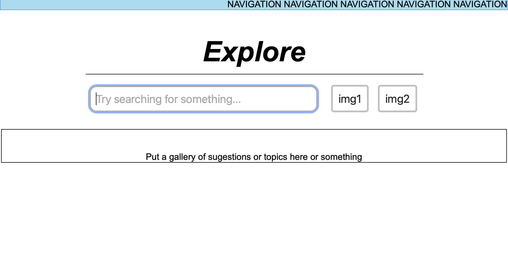

** 
   Part 0: Data Interactions 
**

1. <strong>video game trending news data</strong>: it will display at the home page, we are going to fetch the news data about video game from API, export thoes data to our home page, that allow user to find the recent interesting news about video game. users will click on the news link and get to the news page. (Yangyang Lin)

2. <strong> some user browser data from community posts</strong>: the webside will allow people to post and comment, we will display the latest posts from community at the home page, users will see those posts, and they are allowed to comment on the posts, so we could get some data such as "how many users have checked this post" "how many people like this post" and also "how many comments under this post" and based on this data, we could rank the posts, so the most welcome post will be pushed to the top. (Samuel)

3. <strong>favorite video game list data </strong>: users will allow to choose their favorite games from the database (fetch from API), they will create a game list for themselves.(Ben)

** 
   Part 1: Wireframes
**

   
   we have two major parts: collection and community, community will be embeded into home page.

   (Yangyang Lin)

   
   
    
   (BenJamin McCann)

   
   
    
   (BenJamin McCann)

   
   
    
   (BenJamin McCann)

   
   
    
   (BenJamin McCann)
  

** 
   Part 2: HTML and CSS
**

   
 this is the home page of website

   (BenJamin McCann and Yangyang Lin)
   
   
this is collection page of website

   (BenJamin McCann and Samuel High)
   
   
 this is the explore page of website

   (Samuel High)
 
