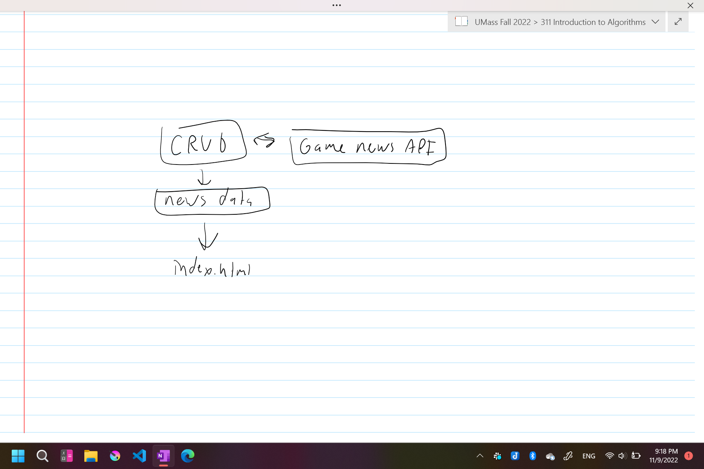
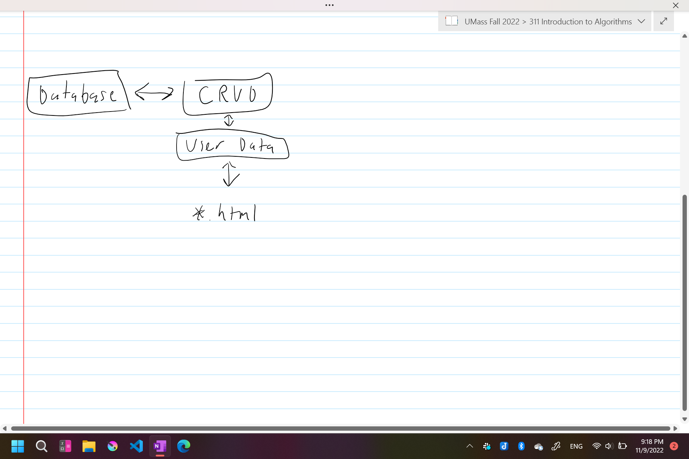
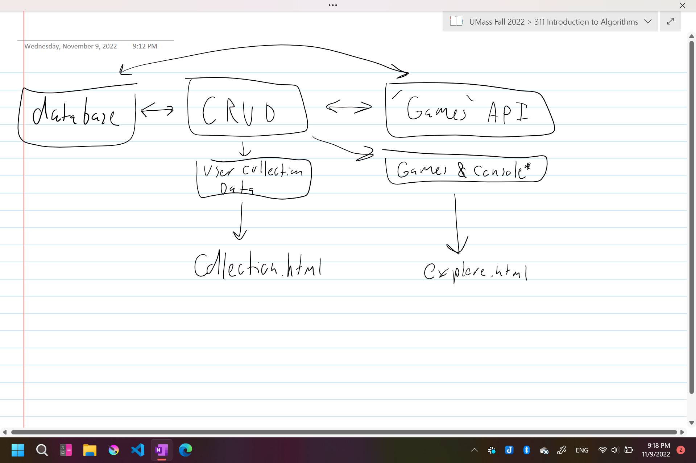
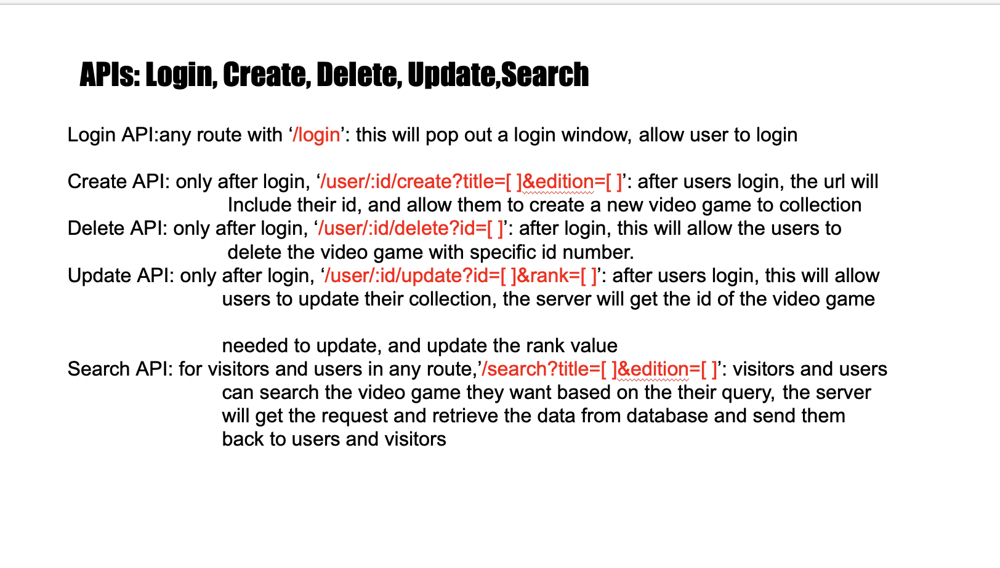
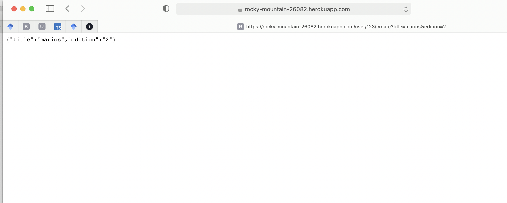

** 
   Part 0: Project API Planning
**

   
   APIs we plan to use CRUD, obviously as well as the API provided by <a href="https://rawg.io/apidocs">RAWG</a>. Idealistically, I'd like to find an API that contains data on consoles as <a href="consolevariations.com">consolevariations</a> does, but we haven't found it yet.(Ben) 
   
  Basic API graphs:
   
  (Ben)
  
   (Ben)
  
  (Ben)
  (Yangyang && Samuel)
  (Yangyang && Samuel)
   
   
  
