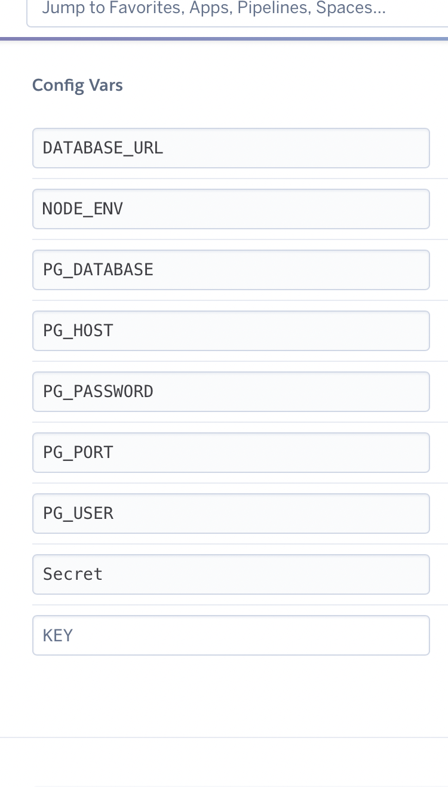
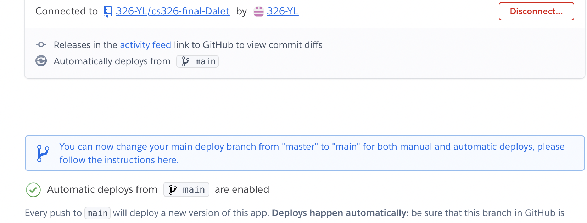

** 
   Part 1: Database Implementation
** 

   In the below images, I show the databases we created for our project, as well as an exmaple usage. I will explain the reasons we decided upon these. 
   users: Currently, we've chosen to implement a very basic user database. The uid (user id) will be automatically generated via the 'SERIAL' variable, and the username and passwords will simply be stored as VARCHAR(255). We have yet to implement any password encryption, yet intend to. We may also eventually add features such as a profile picture, and possibly user-created posts, although as of now the scope is above us. 
   consoles: This is a database I (Ben) had initially hoped to get from an API, however, it was later found that the API may not exist. I personally sought this feature from the beginning, and thus took it upon myself to get the data (details in part 2). Currently, the database contains (cid, Brand, Type, name, imgurl). cid is the console id, Brand is the company that created/owns rights to the console, type is the generalized console, name is the specific console name (taken from consolevariations.com) and imgurl (image url) is the url used in consolevariations.com. 
   userownconsole: This was an idea given to us by a UCA, Seth. A large database that contains what user owns what console, globally. With this, we can easily 'INNER JOIN' a database and find what user owns which console(s) or vice versa. It's set to a primary key, so that a user cannot own multiple of the same console (For show purposes).

   
   (Ben)
   
   
   (Ben)

   we have updated the crud operation of create, delete, update after user login, thoes operations will fetch the url
   param query strings 
   for create operation, it will be /user/:id/create?cid=''&uid='', this will create the new console
   game with its cid and uid,once we fetch the data from url query, then will use postgrelsql to insert new game into our game
   database.
   for update operation, it will be /user/:id/update/:gameID?cid='',this will fetch the gameID from url, then update the game where 
   its game id euqals to the user's request game id, then will call postgresql update method to update the value from our game table 
   for delete operation, it will be/user/:id/delete?id='', this also fetch the id from url, then delete the game with id='' from table 
   if you need to test the operation, use "/user/123/" id=123 is a test id for current deployment 
   (Yangyang Lin) 
 
   
     we have create the secret.json file, and also create .gitignore file, add the secret.json to the gitignore, this will ignore the secret.json
   file each time we commit the code, so secret.json will not be commited 
   (Yangyang Lin) 
   
** 
   Part 2: Back-end Functionality
** 

   Ben: 
   Before we started database implementation, I used a web-scraping to attain console information, which I then created a program to parse that information and create a relevant .JSON file that contains an array of Objects, of values: (Brand, Console, name, img-url). I did this because a feature I truly wish to see in the project is a multi-console collection feature, because some collectors have more than one of a specific type of console. There does not seem to exist an API for this data. I also have yet to fully scrape all data. 
   I Then worked to add PostGres to our Heroku app. It took some time to figure out, and I had help from a UCD, Seth. Yangyang and I managed to add the addon to the app, and I worked to learn how to use SQL with node. I managed to implement the following features:
   <ul>
      <li>Learn to fully create, insert, and select from database</li>
      <li>Users can now signup to the website, and have an entry created in the database</li>
      <li>2 users cannot choose the same username</li>
      <li>User can login, and temporality, it will send to a page where it shows the password they typed in.</li>
      <li>Created a consoles database that adds all the .JSON data I have compiled into the database</li>
      <li>Going to '/showusers' will show all that data</li>
      <li>Going to '/showconsole' will show all that data (815 items currently)</li>
      <li>Going to '/showuserownconsole' will show all that data (Only select samples)</li>
      <li>Started a userownconsole database, where it combines a user id to a console id</li>
   </ul>

   **Part 3**
   
    
   we have created the global environment variable both in the app code (.env this file will be ignored to commit) and also include them in the 
   heroku database setup.
    
   
   link the github repo with heroku and enable the auto-deployment
    
   (Yangyang Lin)
   
   **label division**
   1.implement the database connection and also create user and game table,test the database fucntion with testing data (Ben)
   2.improve collection page UI, and adding functionality that interact with server side (Ben)
   3.improve the explore page UI, and adding more functionality (Samuel)
   4.improve the crud operationa and combine with database implementation (Yangyang Lin)
   
   
